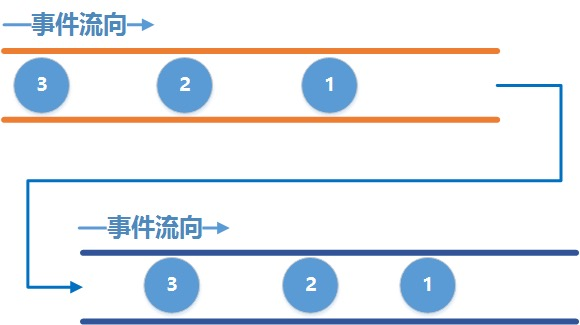

# RxJava Project
本文并非原创，通过各位博主综合学习总结而得，以便供自己方便学习，在此感谢各位前辈，并在下面注明出处。

## ObservableEmitter、Disposable、subscribe() 解释
### ObservableEmitter 
Emitter 是发射器的意思，那就很好猜了，这个就是用来发出事件的，它可以发出三种类型的事件，通过调用 emitter 的 onNext(T value)、onComplete() 和 onError(Throwable error) 就可以分别发出 next 事件、complete 事件和 error 事件。

注意，并不意味着可以随意发射乱七八糟的事件，需要满足一定的规则：

- 上游可以发送无限个 onNext, 下游也可以接收无限个 onNext.
- 当上游发送了一个 onComplete 后, 上游 onComplete 之后的事件将会继续发送, 而下游收到 onComplete 事件之后将不再继续接收事件.
- 当上游发送了一个 onError 后,  上游 onError 之后的事件将继续发送, 而下游收到onError事件之后将不再继续接收事件.
- 上游可以不发送 onComplete 或 onError.
- 最为关键的是 onComplete 和 onError必须唯一并且互斥, 即不能发多个 onComplete, 也不能发多个 onError,  也不能先发一个 onComplete, 然后再发一个 onError, 反之亦然

> 注: 关于 onComplete 和 onError 唯一并且互斥这一点,  是需要自行在代码中进行控制, 如果你的代码逻辑中违背了这个规则, **并不一定会导致程序崩溃.** 比如发送多个onComplete是可以正常运行的, 依然是收到第一个 onComplete 就不再接收了, 但若是发送多个 onError, 则收到第二个 onError 事件会导致程序会崩溃， [代码仓库里](https://github.com/leaderliang/RxJavaProject/blob/master/app/src/main/java/com/android/rxjavaproject/RxUsage.java) 里都有写出。

### Disposable
单词的字面意思是一次性用品,用完即可丢弃的.  那么在RxJava中怎么去理解它呢, 对应于上面的水管的例子, 我们可以把它理解成两根管道之间的一个机关, 当调用它的 dispose() 方法时, 它就会将两根管道切断, 从而导致下游收不到事件.

> 注意: 调用 dispose() 并不会导致上游不再继续发送事件, 上游会继续发送剩余的事件.

### subscribe()
subscribe 有好几个重载方法

```
public final Disposable subscribe() {}
public final Disposable subscribe(Consumer<? super T> onNext) {}
public final Disposable subscribe(Consumer<? super T> onNext, Consumer<? super Throwable> onError) {} 
public final Disposable subscribe(Consumer<? super T> onNext, Consumer<? super Throwable> onError, Action onComplete) {}
public final Disposable subscribe(Consumer<? super T> onNext, Consumer<? super Throwable> onError, Action onComplete, Consumer<? super Disposable> onSubscribe) {}
public final void subscribe(Observer<? super T> observer) {}
```
- 最后一个带有 Observer 参数的在 RxUsage 中的 commonUsageForChain（）已使用过；
- 不带任何参数的 subscribe() 表示下游不关心任何事件,你上游尽管发你的数据去吧, 下游可不关心你发什么；
- 带有一个 Consumer 参数的方法表示下游只关心 onNext 事件, 其他的事件我假装没看见, 因此我们如果只需要 onNext 事件可以这么写；
- 其他几个方法同理, 这里就不解释啦，下面示例已列出。

```
Observable.create(new ObservableOnSubscribe<Integer>() {
            @Override
            public void subscribe(ObservableEmitter<Integer> emitter) throws Exception {
                Log.d(TAG, "emitter 1");
                emitter.onNext(1);
                Log.d(TAG, "emitter 2");
                emitter.onNext(2);
                Log.d(TAG, "emitter 3");
                emitter.onNext(3);
                Log.d(TAG, "emitter complete");
                emitter.onComplete();
                Log.d(TAG, "emitter 4");
                emitter.onNext(4);
            }
        }).subscribe(new Consumer<Integer>() {
            @Override
            public void accept(Integer integer) throws Exception {
                Log.d(TAG, "onNext: " + integer);
            }
        }, new Consumer<Throwable>() {
                    @Override
                    public void accept(Throwable throwable) throws Exception {
                        
           }
        }...);
```

## RxJava 强大的线程控制
### 上下游默认是在同一个线程工作
在主线程中分别创建上游和下游, 然后将他们连接在一起, 同时分别打印出它们所在的线程
```
@Override
protected void onCreate(Bundle savedInstanceState) {
    super.onCreate(savedInstanceState);
    setContentView(R.layout.activity_main);
    Observable<Integer> observable = Observable.create(new ObservableOnSubscribe<Integer>() {
        @Override
        public void subscribe(ObservableEmitter<Integer> emitter) throws Exception {
            Log.d(TAG, "Observable thread is : " + Thread.currentThread().getName());
            Log.d(TAG, "emit 1");
            emitter.onNext(1);
        }
    });

    Consumer<Integer> consumer = new Consumer<Integer>() {
        @Override
        public void accept(Integer integer) throws Exception {
            Log.d(TAG, "Observer thread is :" + Thread.currentThread().getName());
            Log.d(TAG, "onNext: " + integer);
        }
    };

    observable.subscribe(consumer);
}
```
运行结果为:
```
E/RxUsage: TAG: Observable thread is : main
E/RxUsage: TAG: emit 1                     
E/RxUsage: TAG: Observer thread is :main   
E/RxUsage: TAG: onNext: 1
```
### 在子线程中做耗时的操作, 然后回到主线程中来操作 UI


黄色水管表示子线程, 深蓝色水管表示主线程;
我们需要先改变上游发送事件的线程, 让它在子线程中发送事件, 然后再改变下游的线程, 让它去主线程接收事件. 通过 RxJava 内置的线程调度器可以轻松做到这一点。

```

public static void testPrintThreadName(){
    Observable<Integer> observable = Observable.create(new ObservableOnSubscribe<Integer>() {
        @Override
        public void subscribe(ObservableEmitter<Integer> emitter) throws Exception {
            Log.d(TAG, "Observable thread is : " + Thread.currentThread().getName());
            Log.d(TAG, "emit 1");
            emitter.onNext(1);
        }
    });

    Consumer<Integer> consumer = new Consumer<Integer>() {
        @Override
        public void accept(Integer integer) throws Exception {
            Log.d(TAG, "Observer thread is :" + Thread.currentThread().getName());
            Log.d(TAG, "onNext: " + integer);
        }
    };

    observable.subscribeOn(Schedulers.newThread())
            .observeOn(AndroidSchedulers.mainThread())
            .subscribe(consumer);
}
```

```
E/RxUsage: Observable thread is : RxNewThreadScheduler-1
E/RxUsage: emit 1
E/RxUsage: Observer thread is :main
E/RxUsage: onNext: 1
```
从打印结果可以看出, 上游发送事件的线程的确改变了, 是在一个叫  RxNewThreadScheduler-1 的线程中发送的事件, 而下游仍然在主线程中接收事件,这就完美实现了在 Android 中在子线程中做完耗时操作，然后在主线程更新 UI 的操作。

切换线程主要通过以下两行操作来实现的
```
.subscribeOn(Schedulers.newThread())                                              
.observeOn(AndroidSchedulers.mainThread()) 
```
`subscribeOn()` 指定的是上游发送事件的线程；`observeOn()` 指定的是下游接收事件的线程；

补充：
>多次指定 `上游` 的线程只有第一次指定的有效, 也就是说多次调用 subscribeOn() 只有`第一次的有效`, 其余的会被忽略；
多次指定 `下游` 的线程是可以的, 也就是说每调用一次 observeOn() , `下游的线程就会切换一次`。

为上面补充举个例子，方法见 RxUsage -> testPrintThreadNameMoreChange（）
```
observable.subscribeOn(Schedulers.newThread())     
         .subscribeOn(Schedulers.io())              
         .observeOn(AndroidSchedulers.mainThread()) 
         .observeOn(Schedulers.io())                
         .subscribe(consumer);
```
上下游分别指定了两次发送事件的线程，上游分别是newThread和IO线程, 下游分别是main和IO线程。结果如下：
```
E/RxUsage: Observable thread is : RxNewThreadScheduler-1
E/RxUsage: emit 1
E/RxUsage: Observer thread is :RxCachedThreadScheduler-2
E/RxUsage: onNext: 1
```              
可以看到, 上游虽然指定了两次线程, 但只有第一次指定的有效, 依然是在 RxNewThreadScheduler 线程中, 而下游则在 RxCachedThreadScheduler 中, 这个 CacheThread 就是IO线程池中的一个。

可以通过 doOnNext（）清晰的看到下游的线程切换过程, 打印 log

```
observable.subscribeOn(Schedulers.newThread())
        .subscribeOn(Schedulers.io())
        .observeOn(AndroidSchedulers.mainThread())
        .doOnNext(new Consumer<Integer>() {
            @Override
            public void accept(Integer integer) throws Exception {
                Log.e(TAG, "After observeOn(mainThread), current thread is: " + Thread.currentThread().getName());
            }
        })
        .observeOn(Schedulers.io())
        .doOnNext(new Consumer<Integer>() {
            @Override
            public void accept(Integer integer) throws Exception {
                Log.e(TAG, "After observeOn(io), current thread is: " + Thread.currentThread().getName());
            }
        })
        .subscribe(consumer);
```
上下游线程切换之后, 把当前的线程打印出来, 运行结果:
```
E/RxUsage: Observable thread is : RxNewThreadScheduler-1
E/RxUsage: emit 1
E/RxUsage: After subscribeOn(newThread), current thread is: RxNewThreadScheduler-1
E/RxUsage: After subscribeOn(io), current thread is: RxNewThreadScheduler-1
E/RxUsage: After observeOn(mainThread), current thread is: main
E/RxUsage: After observeOn(io), current thread is: RxCachedThreadScheduler-2
E/RxUsage: Observer thread is :RxCachedThreadScheduler-2
E/RxUsage: onNext: 1
```
可以看到, 每调用一次 `subscribeOn` 和 `observeOn()` 线程都会切换一次, 项目中如果有有类似的需求时, 可灵活处理。

在 RxJava 中, 内置的线程：
- Schedulers.io() 代表io操作的线程, 通常用于网络,读写文件等io密集型的操作
- Schedulers.computation() 代表CPU计算密集型的操作, 例如需要大量计算的操作
- Schedulers.newThread() 代表一个常规的新线程
- AndroidSchedulers.mainThread()  代表Android的主线程

在 RxJava 内部使用的是线程池来维护这些线程, 效率相对比较高.

### RxJava 在 Android 中的实践

对于 Android 开发来说, 经常会将一些耗时的操作放在后台, 比如网络请求或者读写文件,操作数据库等等,等到操作完成之后回到主线程去更新 UI 这样的场景经常用到。

要使用Retrofit,先添加Gradle配置:

```
/*RxJava*/
implementation 'io.reactivex.rxjava2:rxjava:2.2.8'
implementation 'io.reactivex.rxjava2:rxandroid:2.1.1'
/*retrofit*/
implementation 'com.squareup.retrofit2:retrofit:2.5.0'
/*Gson converter*/
implementation 'com.squareup.retrofit2:converter-gson:2.5.0'
/*RxJava2 Adapter*/
implementation 'com.jakewharton.retrofit:retrofit2-rxjava2-adapter:1.0.0'
/*okHttp*/
implementation 'com.squareup.okhttp3:okhttp:3.12.0'
implementation 'com.squareup.okhttp3:logging-interceptor:3.9.0'
/*fastJson*/
implementation 'com.alibaba:fastjson:1.2.56'
```
具体操作可点击查看代码，主要有这几个类，另外使用了 https://api.github.com/ 接口：

[GithubService.java ](https://github.com/leaderliang/RxJavaProject/blob/150273c7a6697bd8c08be8bacb24027397bd9336/app/src/main/java/com/android/rxjavaproject/retrofit/GithubService.java)

[Repo.java](https://github.com/leaderliang/RxJavaProject/blob/150273c7a6697bd8c08be8bacb24027397bd9336/app/src/main/java/com/android/rxjavaproject/retrofit/Repo.java)

[RetrofitClient](https://github.com/leaderliang/RxJavaProject/blob/150273c7a6697bd8c08be8bacb24027397bd9336/app/src/main/java/com/android/rxjavaproject/RetrofitClient.java)

都统一在 MainActivity 中进行调用。

看似很完美, 但我们忽略了一点, 如果在请求的过程中 Activity 已经退出了, 这个时候如果回到主线程去更新 UI, 那么APP肯定就崩溃了, 可以往上翻 [Disposable](#Disposable) , 说它是个开关, 调用它的dispose()方法时就会切断水管, 使得下游收不到事件, 既然收不到事件, 那么也就不会再去更新UI了. 因此我们可以在 Activity 中将这个 Disposable 保存起来, 当 Activity退出时, 切断它即可.
那如果有多个 Disposable 该怎么办呢, RxJava 中已经内置了一个容器 `CompositeDisposable`, 每当我们得到一个 `Disposable` 时就调用 `CompositeDisposable.add()` 将它添加到容器中, 在退出的时候, 调用 `CompositeDisposable.clear()` 即可切断所有的水管.

## RxJava 中强大的操作符


## 说明
本文并非原创，通过各位博主综合学习总结而得，以便供自己方便学习，在此感谢各位前辈，并在下面注明出处。
- [https://www.jianshu.com/u/c50b715ccaeb](https://www.jianshu.com/u/c50b715ccaeb)


